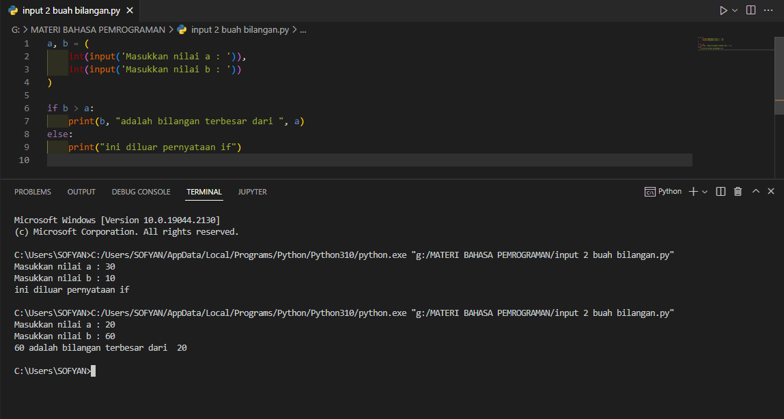
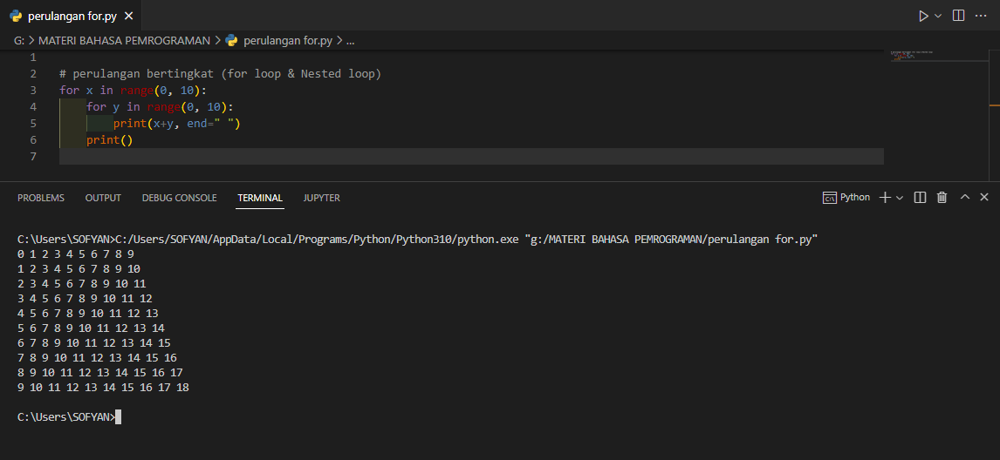
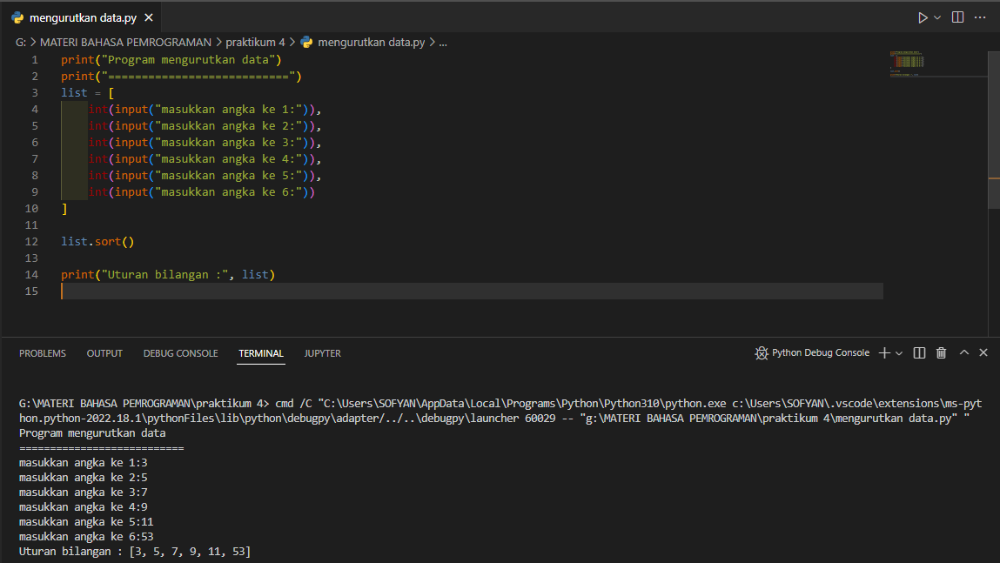
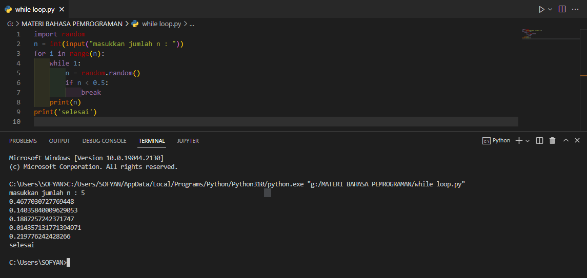

**DAFTAR ISI**
> - [LATIHAN 1](##-LATIHAN-1)
> - [LATIHAN 2](##-LATIHAN-2)
> - [LATIHAN 3](##-LATIHAN-3)
> - [LATIHAN 4](##-LATIHAN-4)

## LATIHAN 1
Program mencari bilangan terbesar dari 2 buah bilangan

Meminta inputan dari user dengan menggunakan fitur destruksi atau mengisi beberapa variabel secara sekaligus.  
a, b = (
    int(input('Masukkan nilai a : ')) 
    int(input('Masukkan nilai b : '))
)

jika variable b kurang dari a:  
if b > a: 
    print(b, "adalah bilangan terbesar dari ", a) 
print("ini diluar pernyataan if")

## LATIHAN 2
perulangan bertingkat (for loop & Nested loop)

## LATIHAN 3
Program mengurutkan data dari yang terkecil ke besar

## LATIHAN 4
Program mencari nilai kurang dari 0.5 dengan nilai range(n)

